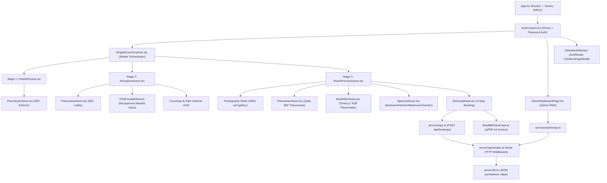

# FULL PROJECT AUDIT & TECHNICAL HANDOVER REPORT
**Project:** Renoos Hotel (formerly SB Farm Sanctuary)  
**Location on Disk:** `S:\renoos`  
**Date of Audit:** October 9, 2026  
**Auditor:** Antigravity AI Assistant  
**Nature of Report:** Factual Codebase & Asset Analysis (Analysis-Only)

---

## 1. Executive Summary & Project Overview

### 1.1 Purpose
The project is a high-end web application for **Renoos Hotel** (an architectural luxury nature resort in the Himalayan foothills of Uttarakhand, India). Its central purpose is to provide an immersive, continuous 3-stage visual guest journey:
1. **Stage 1 (Hotel Exterior):** A 360° panoramic entrance tour featuring ambient mountain breeze audio synthesis, an interactive glass double-door entrance beacon, and a cinematic forward-dolly transition into the lobby.
2. **Stage 2 (Lobby & Reception):** A photorealistic / 360° front desk experience featuring authentic Marathi customer care voice audio playback (`Anika`), an interactive "Welcome Menu" on the left of the receptionist, a "Book a Suite" beacon on the right of the receptionist, and a frosted-glass transparent concierge interface.
3. **Stage 3 (Room Preview & Booking):** An interactive suite cockpit for Suites 201, 202, and 203 supporting three synchronized viewing modes (real photography, 360° spherical virtual tour, and 3D architectural viewer placeholder), granular space selection (Bedroom, Kitchen, Washroom, Garden), live multi-user concurrency checking, an instant reservation modal, and automated client-side A4 vector tax invoice PDF generation.
4. **Administrative Back-Office (`/admin`):** A standalone Property Management System (PMS) admin dashboard protected by passcode, enabling real-time occupancy monitoring, housekeeping status updates, guest directory tracking, walk-in reservation entry, and reservation status transitions.

### 1.2 Technology Stack & Exact Versions (Confirmed from `package.json`)
- **Runtime & Tooling:**
  - Node.js (ES Modules, `"type": "module"`)
  - Vite: `^8.3.0` (with custom server middleware plugin `renoosApiPlugin`)
  - TypeScript: `~6.0.2`
  - PostCSS: `^8.5.28` & Autoprefixer: `^10.6.1`
  - Oxlint: `^1.81.0` (Fast JavaScript/TypeScript linter)
  - Puppeteer-Core: `^25.12.0` (Used for headless verification scripts)
- **Frontend Core:**
  - React: `^19.2.8`
  - React DOM: `^19.2.8`
  - React Router DOM: `^7.18.4`
- **3D & Panorama Rendering:**
  - Three.js: `^0.186.1`
  - `@react-three/fiber`: `^9.8.1`
  - `@react-three/drei`: `^10.7.9`
  - `@types/three`: `^0.186.0`
- **Styling & Motion:**
  - Tailwind CSS: `^3.4.17`
  - `clsx`: `^2.1.1` & `tailwind-merge`: `^3.7.0`
  - `framer-motion`: `^13.4.6`
  - `lucide-react`: `^1.49.0` (iconography)
- **Document & PDF Generation:**
  - `jspdf`: `^4.2.1` (Vector A4 tax invoices)
  - `html2canvas`: `^1.4.1`

### 1.3 Entry Points & Routing
- **`index.html`:** Configures HTML5 document metadata (`Renoos Hotel | Luxury Mountain Sanctuary & 360° Experience`), Google Fonts (`Newsreader`, `Playfair Display`, `Plus Jakarta Sans`), and mounts `/src/main.tsx`.
- **`src/main.tsx`:** StrictMode root rendering `<App />`.
- **`src/App.tsx`:** Configures `AuthProvider`, global auth modals (`AuthModal`, `UserBookingsModal`), and React Router:
  - `/` -> `<SingleScreenExplorer />` *(Confirmed)*
  - `/rooms` -> `<SingleScreenExplorer />` *(Confirmed)*
  - `/rooms/:roomId` -> `<SingleScreenExplorer />` *(Confirmed)*
  - `/admin` -> `<AdminDashboardPage />` *(Confirmed)*
  - `*` -> `<SingleScreenExplorer />` *(Confirmed)*
- **Legacy / Orphaned Pages:** `src/pages/HomePage.tsx`, `src/pages/RoomsPage.tsx`, and `src/pages/RoomDetailPage.tsx` exist in the repository but are currently not routed in `App.tsx`.

---

## 2. Complete User Journey: Step-by-Step Audit

| Step | User Action | Implementing Component | State & Navigation Mechanism | Confirmed Working Status | Notes & Limitations |
|---|---|---|---|---|---|
| **1. Hotel Exterior 360°** | User lands on `/` | `src/components/hotel3d/Hotel3DScene.tsx` inside `SingleScreenExplorer.tsx` | URL stage parameter `?stage=hotel-exterior`. Active stage state in `SingleScreenExplorer.tsx`. | **Confirmed Working** | Loads `public/images/Renos Hotel at Golden Hour.png` in 360° sphere. Synthesizes mountain breeze audio via Web Audio API. Entrance door hotspot is placed at `yaw: 180, pitch: -2.5`. |
| **2. Walk to Reception** | Click door beacon or "Walk to Reception & Book Rooms" button | `Hotel3DScene.tsx` | Triggers `handleWalkIntoReception()`, plays Web Audio chime, sets forward dolly zoom (`scale: 1.14`, blur), waits 750ms, then invokes `onEnterReception()`. | **Confirmed Working** | Transitions `SingleScreenExplorer` stage to `'reception'`. Shows transient transition overlay. |
| **3. Reception / Lobby** | Arrives at Grand Lobby | `src/components/reception/ReceptionScene.tsx` | Stage `'reception'`. URL updated to `?stage=reception`. Supports two view modes: `360-lobby` and `desk-photo`. | **Confirmed Working** | Uses `public/images/Luxury Mountain Resort Lobby.png`. Plays Marathi customer care audio greeting (`Anika`) automatically or on first gesture. |
| **4. Welcome Menu & Concierge** | Click "Welcome Menu" beacon on left side of receptionist | `ReceptionScene.tsx` | Hotspot `hs-lobby-welcome` (`yaw: 166, pitch: -13`) sets `viewState = 'greeting'`. | **Confirmed Working** | Opens frosted-glass concierge card on right side of viewport with lotus emblem, audio player controls, and sanctuary information. |
| **5. Book a Suite / Date Selection** | Click "Book a Suite" beacon on right side of receptionist or "Book a Room" button | `ReceptionScene.tsx` | Hotspot `hs-lobby-book` (`yaw: 194, pitch: -13`) sets `viewState = 'dates'`. | **Confirmed Working** | Opens compact date selector (Check-in, Check-out, Adults, Children). Calculates nights. Validates dates (`checkOut > checkIn`). |
| **6. Continue to Room Preview** | Click "Continue to Room Preview ->" | `ReceptionScene.tsx` -> `SingleScreenExplorer.tsx` | Calls `onContinueToRoomPreview(dates)`. Updates `bookingDates` in `SingleScreenExplorer`, switches stage to `'room-preview'` (`?stage=room-preview`). | **Confirmed Working** | Passes check-in, check-out, adults, children to `RoomPreviewScene.tsx`. |
| **7. Suite Selection (201, 202, 203)** | Click suite pill tabs in header | `src/components/rooms/RoomPreviewScene.tsx` | `selectedRoomId` state (`'201'`, `'202'`, `'203'`). Reads room specs from `src/data/rooms.ts`. | **Confirmed Working** | Polling every 4s queries `/api/availability` to mark rooms red/disabled if booked by another guest. |
| **8. Multi-Mode Viewing (Photo / 360° / 3D)** | Toggle Photo, 360°, 3D buttons | `RoomPreviewScene.tsx` | `viewMode` state (`'photo'`, `'360'`, `'3d'`). | **Partially Implemented** | **Photo:** Confirmed working (loads real `.avif` photos from `/IMG/`). **360°:** Confirmed working (loads 2:1 panoramas from `/panoramas/`). **3D:** Placeholder only (renders architectural "Coming Soon" card because `.glb` files do not exist). |
| **9. Space Navigation** | Click Bedroom, Kitchen, Washroom, Garden pills | `src/components/rooms/SpaceSelector.tsx` | `selectedSpaceKey` state. Updates active space photo, panorama, and specs. | **Confirmed Working** | Hotspots inside panoramas also trigger navigation between spaces smoothly. |
| **10. Booking Initiation** | Click "Book Room [Number]" in bottom reservation bar | `RoomPreviewScene.tsx` -> `src/components/booking/BookingModal.tsx` | Sets `isBookingModalOpen = true`. | **Confirmed Working** | Disabled with "Unavailable" badge if room has a date conflict in the PMS API. |
| **11. Guest Info & Payment Form** | Step 1: Enter guest details. Step 2: Choose payment method. Step 3: Confirm. | `BookingModal.tsx` | 3-step modal flow (`guest` -> `payment` -> `confirmed`). Validates email, phone, name. Auto-fills if user is logged in. | **Confirmed Working** | Supports Credit Card, UPI, and Pay at Hotel. Handles 409 Conflict if another user reserved concurrently. |
| **12. Confirmation & PDF Invoice** | Confirmation screen with Reference, buttons to download/print | `BookingModal.tsx` -> `src/lib/pdfBillGenerator.ts` | Calls `submitBookingToApi()` -> POST `/api/bookings`. Saves to `data/bookings.json`. Calls `generateReservationPDF()`. | **Confirmed Working** | Generates authentic Indian GST Tax Invoice & Voucher PDF (A4 format) with CGST, SGST, SAC codes, and triggers file download. |

---

## 3. Architecture and Data Flow

### 3.1 Component Hierarchy & Orchestration Diagram

### 3.2 State Lifecycle & Data Movement
- **Dates & Guests:** Initialized in `SingleScreenExplorer.tsx` with default values (tomorrow -> +2 nights, 2 adults, 0 children). Passed to `ReceptionScene.tsx` where the guest can edit them. Returned via `onContinueToRoomPreview(dates)` and threaded into `RoomPreviewScene.tsx` and `BookingModal.tsx`.
- **Suite & Space Selection:**
  - `selectedRoomId`: Managed in `RoomPreviewScene.tsx` (`201` -> `202` -> `203`).
  - `selectedSpaceKey`: Managed in `RoomPreviewScene.tsx` (`bedroom`, `kitchen`, `washroom`, `garden`).
- **Availability State:**
  - `RoomPreviewScene` polls `/api/availability?checkIn=...&checkOut=...` every 4,000ms.
  - Updates an `AvailabilityMap`. If a suite has a conflict, its tab is marked "Booked" in red and the booking button is disabled with an explanatory banner.
- **Reservations & Concurrency:**
  - `BookingModal` sends a structured JSON payload to `/api/bookings`.
  - `server/apiHandler.ts` checks `isRoomAvailable()`. If overlapping dates exist on a confirmed/checked_in booking, it responds with HTTP `409 Conflict`.
  - On success (HTTP `201`), the booking is appended atomically to `data/bookings.json`, synced with `localStorage`, and added to the user's logged-in account.

### 3.3 Redundancies, Unused Components, and Architectural Conflicts
- **Orphaned Pages:**
  - `src/pages/HomePage.tsx` (302 lines): Contains a full traditional hotel landing page with `HeroSection`, `BookingBar`, `BookRoomsSection`, `CTASection`. It is never rendered because `App.tsx` routes `/` to `SingleScreenExplorer`.
  - `src/pages/RoomsPage.tsx` (172 lines) & `src/pages/RoomDetailPage.tsx` (46 lines): Classic multi-page listing and detail views, never routed.
- **Unused Components:**
  - `src/components/terminal/ComputerTerminal.tsx`: Legacy terminal workstation wrapper. Never imported or referenced anywhere.
  - `src/components/common/Navbar.tsx`: Never rendered in the current single-screen app.
  - `src/components/common/Footer.tsx`: Never rendered in the current single-screen app.
  - `src/components/common/HeroSection.tsx`: Used only in `HomePage.tsx`.
  - `src/components/common/CTASection.tsx`: Used only in `HomePage.tsx`.
  - `src/components/rooms/RoomCard.tsx`, `RoomGrid.tsx`, `RoomDetails.tsx`, `RoomSwitcher.tsx`, `SpaceViewer.tsx`: Used only in legacy pages.
  - `src/components/booking/BookRoomsSection.tsx`: Duplicate booking interface used only in `HomePage.tsx`.

---

## 4. Asset Inventory

### 4.1 Summary of `public/` Directory
The `public/` directory contains **111 total files**:
- **Images:** 37 `.jpg`, 5 `.png`, 41 `.avif`
- **Audio:** 2 `.mp3`
- **Vectors / Icons:** 2 `.svg` (`favicon.svg`, `icons.svg`)
- **Placeholders / Data:** 18 `.json`, 6 `.md`
- **3D Models:** **0** `.glb` or `.gltf` files exist.

### 4.2 Key Asset Audit Table

| Project-Relative Path | Format | Dimensions | Aspect Ratio | Classification | Code Usage Location | Assessment / Status |
|---|---|---|---|---|---|---|
| `public/images/Renos Hotel at Golden Hour.png` | PNG | 1774 x 887 | 2.00:1 | Equirectangular 360° Panorama | `src/components/hotel3d/Hotel3DScene.tsx` | **Confirmed Active.** True 2:1 ratio. Serves as Stage 1 exterior entrance tour. Note file spelling is `Renos` (single 'o'). |
| `public/images/Luxury Mountain Resort Lobby.png` | PNG | 1774 x 887 | 2.00:1 | Equirectangular 360° Panorama | `src/components/reception/ReceptionScene.tsx` | **Confirmed Active.** True 2:1 ratio. Serves as Stage 2 Grand Lobby 360° tour AND photo desk view. Features embedded "RENOS HOTEL" gold illuminated wall logo. |
| `public/images/receptionist-desk.jpg` | PNG (misnamed as .jpg) | 1774 x 887 | 2.00:1 | Equirectangular 360° Panorama | `src/data/rooms.ts` | **Duplicate.** Byte-for-byte identical to `Luxury Mountain Resort Lobby.png` (2,414.6 KB). File header is PNG `0x89504E47` despite `.jpg` extension. |
| `public/panoramas/reception/reception-360.jpg` | PNG (misnamed as .jpg) | 1774 x 887 | 2.00:1 | Equirectangular 360° Panorama | Unused | **Duplicate.** Byte-for-byte identical to `Luxury Mountain Resort Lobby.png`. |
| `public/panoramas/hotel/hotel-exterior-360.jpg` | JPEG | 1774 x 887 | 2.00:1 | Equirectangular 360° Panorama | Unused | Alternate exterior panorama. |
| `public/images/hotel-exterior-hero.jpg` | JPEG | 1774 x 887 | 2.00:1 | Equirectangular 360° Panorama | `src/components/common/HeroSection.tsx` | Used in orphaned `HeroSection.tsx`. |
| `public/images/sb-farm-sanctuary-resort-welcome.png` | PNG | 1675 x 939 | 1.78:1 (16:9) | Standard Photography | Unused in active app | Legacy reference image containing "SB FARM SANCTUARY" branding. |
| `public/images/hotel-reception-reference.png` | PNG | 1675 x 470 | 3.56:1 | Panoramic Strip Crop | Unused in active app | Cropped design reference banner. |
| `public/images/hotel-exterior-reference.png` | JPEG | 1024 x 512 | 2.00:1 | Equirectangular 360° Panorama | Unused | Earlier low-res test panorama. |
| `public/panoramas/room-201/bedroom.jpg` | JPEG | 2912 x 1440 | 2.02:1 | Equirectangular 360° Panorama | `src/data/rooms.ts` | **Confirmed Active.** High-resolution bedroom 360° panorama for Room 201. |
| `public/panoramas/room-201/kitchen.jpg` | JPEG | 2912 x 1440 | 2.02:1 | Equirectangular 360° Panorama | `src/data/rooms.ts` | **Confirmed Active.** High-resolution kitchen 360° panorama for Room 201. |
| `public/panoramas/room-201/washroom.jpg` | JPEG | 2912 x 1440 | 2.02:1 | Equirectangular 360° Panorama | `src/data/rooms.ts` | **Confirmed Active.** High-resolution washroom 360° panorama for Room 201. |
| `public/panoramas/room-202/bedroom.jpg` | JPEG | 2912 x 1440 | 2.02:1 | Equirectangular 360° Panorama | `src/data/rooms.ts` | **Confirmed Active.** Room 202 bedroom panorama. |
| `public/panoramas/room-202/kitchen.jpg` | JPEG | 2912 x 1440 | 2.02:1 | Equirectangular 360° Panorama | `src/data/rooms.ts` | **Confirmed Active.** Room 202 kitchen panorama. |
| `public/panoramas/room-202/washroom.jpg` | JPEG | 2912 x 1440 | 2.02:1 | Equirectangular 360° Panorama | `src/data/rooms.ts` | **Confirmed Active.** Room 202 washroom panorama. |
| `public/panoramas/room-203/bedroom.jpg` | JPEG | 2912 x 1440 | 2.02:1 | Equirectangular 360° Panorama | `src/data/rooms.ts` | **Confirmed Active.** Room 203 bedroom panorama. |
| `public/panoramas/room-203/kitchen.jpg` | JPEG | 2912 x 1440 | 2.02:1 | Equirectangular 360° Panorama | `src/data/rooms.ts` | **Confirmed Active.** Room 203 kitchen panorama. |
| `public/panoramas/room-203/washroom.jpg` | JPEG | 2912 x 1440 | 2.02:1 | Equirectangular 360° Panorama | `src/data/rooms.ts` | **Confirmed Active.** Room 203 washroom panorama. |
| `public/panoramas/garden/garden.jpg` | JPEG | 2912 x 1440 | 2.02:1 | Equirectangular 360° Panorama | `src/data/rooms.ts` | **Confirmed Active.** Shared Garden 360° panorama. |
| `public/IMG/201/*` (10 files) | AVIF | Varying | 4:3 / 16:9 | High-res Real Suite Photos | `src/data/rooms.ts` | **Confirmed Active.** Real photographs of Room 201 living room, kitchen, bathroom. |
| `public/IMG/202/*` (16 files) | AVIF | Varying | 4:3 / 16:9 | High-res Real Suite Photos | `src/data/rooms.ts` | **Confirmed Active.** Real photographs of Room 202 living room, kitchen, washroom. |
| `public/IMG/203/*` (11 files) | AVIF | Varying | 4:3 / 16:9 | High-res Real Suite Photos | `src/data/rooms.ts` | **Confirmed Active.** Real photographs of Room 203 bedroom, kitchen, washroom. |
| `public/audio/ElevenLabs_2026-10-09T05_21_42_Anika - Marathi Customer Care Agent_pvc_sp100_s50_sb75_v4.mp3` | MP3 | 148.4 KB | Audio (18s) | Voice Audio | `src/components/reception/ReceptionScene.tsx` | **Confirmed Active.** Marathi customer care voice welcome. |
| `public/audio/receptionist-voice.mp3` | MP3 | 148.4 KB | Audio (18s) | Voice Audio | `src/components/reception/ReceptionScene.tsx` | **Confirmed Active.** Clean alias fallback copy of the above audio file. |
| `public/models/room-201/` to `203/` | JSON / MD | N/A | N/A | Text / Placeholders | `src/data/rooms.ts` | **No 3D Models Exist.** Only placeholder `.json` and `README.md` files exist. |

---

## 5. 360° and 3D Systems

### 5.1 360° Panorama Implementation (`PanoramaViewer.tsx`)
- **Geometry & Inversion:** Uses a Three.js `<sphereGeometry args={[500, 64, 40]} />` with negative x-scale (`scale={[-1, 1, 1]}`) and `THREE.DoubleSide` material to project the equirectangular texture onto the inside surface of the sphere.
- **Camera Rig:** The PerspectiveCamera is pinned at `(0, 0, 0)`. Yaw (`lon`), pitch (`lat`), and FOV are smoothly interpolated on every animation frame using frame-rate-independent exponential smoothing:
  $$\text{factor} = 1 - \exp(-14 \cdot \min(\Delta t, 0.1))$$
  Camera direction is converted to spherical Cartesian coordinates:
  $$x = 500 \cdot \sin(\phi) \cdot \cos(\theta), \quad y = 500 \cdot \cos(\phi), \quad z = 500 \cdot \sin(\phi) \cdot \sin(\theta)$$
- **Controls & Gestures:**
  - Single pointer drag rotates view with drag sensitivity scaled inversely by FOV.
  - Multi-touch two-pointer pinch adjusts FOV dynamically.
  - Mouse wheel zoom adjusts FOV within `minFov` (40°) and `maxFov` (105°/110°).
  - Keyboard navigation: Arrow keys, WASD, `+` and `-` keys.
- **60 FPS Hotspot Screen Projection:**
  - Rather than rendering Three.js HTML meshes inside the 3D scene (which cause DOM re-rendering overhead), hotspots are projected directly onto screen coordinates using `cam.getWorldDirection()` dot product check and `tempVec.project(cam)`:
    $$\text{screenX} = (x \cdot 0.5 + 0.5) \cdot \text{width}, \quad \text{screenY} = (-y \cdot 0.5 + 0.5) \cdot \text{height}$$
  - Applied via GPU-accelerated CSS `translate3d(...)` on pre-cached DOM element refs.
- **Memory & VRAM Disposal:**
  - On texture change or unmount, `loadedTexture.dispose()` and `prevTexture.dispose()` are explicitly invoked, preventing GPU memory leaks during long browsing sessions.

### 5.2 3D Model System (`Model3DViewer.tsx`)
- **Current State:**
  - `Model3DViewer` is equipped with a complete `@react-three/fiber` and `@react-three/drei` engine (`Canvas`, `OrbitControls`, `useGLTF`, lighting, error boundaries, zoom in/out, reset, and fullscreen).
  - **However, NO `.glb` or `.gltf` model files currently exist** in `public/models/`.
  - In `src/data/rooms.ts`, all spaces have `isPlaceholder: true`.
  - Consequently, `isRealModel` evaluates to `false`, and `Model3DViewer` gracefully renders a high-editorial architectural preview card ("Interactive 3D Walkthrough in Preparation") showing 1:1 scale status, room floor area, and quick-switch buttons to Photography and 360° Tour.
- **Requirements to Activate Real 3D Models:**
  1. Place valid `.glb` binary assets into `public/models/room-201/`, `room-202/`, `room-203/`.
  2. Set `isPlaceholder: false` in `src/data/rooms.ts` for each space.

---

## 6. Booking and Invoice Functionality

### 6.1 Tariff Calculation Logic (Confirmed)
- **Room Base Rates (from `src/data/rooms.ts`):**
  - Room 201 (Deluxe): ₹5,200 / night
  - Room 202 (Mountain View): ₹5,200 / night
  - Room 203 (Executive Sanctuary): ₹8,500 / night
- **Duration:** Calculated in nights based on Check-in and Check-out (`diff >= 1`).
- **Discounts:** 10% promotional discount applied (code `RENOOS` or `SBFARM`).
- **Taxes & Levies:**
  - 12% Indian GST calculated on `(subtotal - discount)`.
  - Split 50/50 into CGST (6%) and SGST (6%) on invoice.
  - Conservation Levy: Included / waived.

### 6.2 Data Persistence & Backend Integration
- **Server:** A real Node.js HTTP server module (`server/apiHandler.ts`) loaded via Vite middleware (`renoosApiPlugin` in `vite.config.ts`).
- **Storage:** JSON file database stored in `data/`:
  - `data/bookings.json`: Persistent array of all reservations. Written atomically using temporary files and `fs.renameSync`.
  - `data/users.json`: Registered customer accounts with salted SHA-256 passwords.
  - `data/rooms_config.json`: Live room operational status and base rates.
- **Client Synchronization:**
  - Client calls `/api/availability` to detect booked date ranges.
  - Client calls POST `/api/bookings` to create reservations.
  - Also saves to `localStorage['renoos_hotel_reservations']` for client-side offline access.
  - Confirmed reservations populate the user's "My Bookings" modal in real time.

### 6.3 PDF Tax Invoice & Printing
- **Implementation:** `src/lib/pdfBillGenerator.ts` using `jspdf`.
- **Features:**
  - Official A4 portrait vector layout (`210mm x 297mm`).
  - Colors: Forest green (`#263D2F`), gold terracotta (`#B8684A`), and warm cream.
  - Legal details: Header with "RENOOS HOTEL", Uttarakhand GSTIN (`05AAACS1234F1Z8`), reservation reference number, date issued.
  - Itemized table with SAC Code `996311` (Hotel accommodation) and `999799` (Sanctuary conservation).
  - Indian currency notation (`Rs. XX,XXX`) and total amount in words (e.g. *"Eleven Thousand Six Hundred and Forty-Eight Only"*).
  - Automated download triggering filename: `Renoos_Hotel_Bill_[REF].pdf`.
  - Separate `printReservationInvoice()` opens clean HTML printable window with `@media print` styling.

---

## 7. UI, Branding, and Responsiveness

### 7.1 Branding Discrepancies (Critical Finding)
There are **three distinct naming conventions** across the project:
1. **Source Code & Current UI:** **"Renoos Hotel"** (double 'o') — used in `App.tsx`, `index.html`, `SingleScreenExplorer.tsx`, `Hotel3DScene.tsx`, `ReceptionScene.tsx`, `RoomPreviewScene.tsx`, and `pdfBillGenerator.ts`.
2. **Key Physical Assets:** **"RENOS HOTEL"** (single 'o') — permanently embedded in the 3D-rendered illuminated golden signage on the reception counter wall in `public/images/Luxury Mountain Resort Lobby.png`, and in the filename `public/images/Renos Hotel at Golden Hour.png`.
3. **Legacy Branding:** **"SB Farm Sanctuary"** — remnants exist in commit history (`Update SB Farm Sanctuary`), in `public/images/sb-farm-sanctuary-resort-welcome.png`, and as fallback promo code `SBFARM` in `BookRoomsSection.tsx`.

*Recommendation:* The application code has adopted "Renoos Hotel", but the visual asset depicts "RENOS HOTEL". This discrepancy should be flagged for brand decision.

### 7.2 Color Palette & Typography
- **Palette (from `tailwind.config.js` and `src/index.css`):**
  - Forest Dark: `#16251C` / `#1A2A20`
  - Forest Green: `#263D2F`
  - Emerald Accents: `#34D399` / `#10B981`
  - Gold / Amber: `#FCD34D` / `#F59E0B`
  - Muted Terracotta: `#B8684A`
  - Warm Ivory / Cream: `#F9F6F0` / `#FAF8F5`
  - Pure Black / Charcoal: `#0D1510` / `#1C231E`
- **Typography:**
  - Serif Display: `Newsreader`, `Playfair Display`, `Cormorant Garamond`
  - Body Sans: `Plus Jakarta Sans`, system sans-serif
  - Monospace Data: `ui-monospace`, `SFMono-Regular`, `Menlo`

### 7.3 Responsiveness & Touch Optimization
- Full viewport height managed with modern `100dvh` to prevent mobile browser URL bar jumping.
- Safe area inset classes: `pt-safe`, `pb-safe`, `pl-safe`, `pr-safe`.
- Mobile-specific adaptations:
  - Header actions fold into clean compact icons on small viewports.
  - Panoramic entrance card in `Hotel3DScene` is collapsible via a "Hide" button to maximize mobile 360° touch viewport.
  - Touch event handlers support single-pointer drag rotation and two-pointer pinch zoom.

---

## 8. Configuration, Dependencies, and Security

### 8.1 Environment Variables & Paths
- **Environment Variables:** No `.env` file is required for normal operation. The app runs completely self-contained with its embedded Vite API middleware.
- **Hardcoded Local Paths:** None in production code. (Testing scripts in `tests/` reference the standard local Chrome executable for Puppeteer runs).
- **Public URL Encoding:** Note that audio asset `public/audio/ElevenLabs_2026-10-09T05_21_42_Anika - Marathi Customer Care Agent_pvc_sp100_s50_sb75_v4.mp3` contains spaces in the filename. Handled in code with URL-encoded fallback path `receptionist-voice.mp3`.

### 8.2 Security & Authentication
- **Guest Authentication:** Custom phone + password system. Passwords are stored in `data/users.json` using salted SHA-256 (`crypto.pbkdf2Sync` with 10,000 iterations).
- **Admin Authentication:** Passcode verified against allowed set (`['renoos2026', 'admin123', 'renoos-hotel-admin']`). Returns an admin session token stored in browser `localStorage`.
- **API Payload Protection:** Payload size limiter (`1MB`) implemented in `server/apiHandler.ts` to prevent denial-of-service memory exhaustion.
- **Production Readiness Note:** For real public production hosting (e.g. AWS/Vercel/Docker), the in-process Vite middleware and flat JSON file storage must be migrated to a true standalone backend service (such as Express, NestJS, or Supabase) with PostgreSQL or SQLite.

---

## 9. Git and Project History

### 9.1 Repository State (Confirmed)
- **Current Branch:** `main`
- **Remote Status:** Ahead of `origin/main` by 1 commit.
- **Unstaged Changes:**
  - `modified: src/components/hotel3d/Hotel3DScene.tsx`
  - `modified: src/components/reception/ReceptionScene.tsx`
- **Untracked Directories:**
  - `public/audio/` (contains reception voice greeting files)
- **Recent Commits:**
  - `0c1f435`: *feat: complete mobile responsiveness for admin panel and remove Maya speech*
  - `8c3a696`: *updated*
  - `c588fb6`: *Updatedd*
  - `a0cf287`: *Update SB Farm Sanctuary*
  - `3c4838c`: *updated version*
  - `adbcf60`: *Initial release*

---

## 10. Current Completion Status

| Feature / Subsystem | Status | Evidence in Codebase | Remaining Work |
|---|---|---|---|
| **Hotel Exterior 360° (Stage 1)** | Implemented in code | `Hotel3DScene.tsx`, `Renos Hotel at Golden Hour.png`, Web Audio ambient synthesis. Hotspot at `yaw: 180, pitch: -2.5`. | None for basic flow. Fine-tuning of outdoor hotspot markers if more points of interest are added. |
| **Walk-In Cinematic Transition** | Implemented in code | `handleWalkIntoReception()` in `Hotel3DScene.tsx`, chime oscillator, forward zoom & blur. | None. Operates smoothly. |
| **Lobby & Reception (Stage 2)** | Implemented in code | `ReceptionScene.tsx`, `Luxury Mountain Resort Lobby.png`, 360° and Photo modes, dual beacons ("Welcome Menu" left, "Book a Suite" right). | None. Both beacons and audio player verified. |
| **Receptionist Audio Greeting** | Implemented in code | `RECEPTIONIST_AUDIO_PATH` with fallback in `ReceptionScene.tsx`, autoplay unlock on customer interaction, header audio controls. | None. Verified in headless test. |
| **Room Preview & Cockpit (Stage 3)** | Implemented in code | `RoomPreviewScene.tsx`, tab switcher for Suites 201, 202, 203, space selector (Bedroom, Kitchen, Washroom, Garden). | None for standard navigation. |
| **Suite Photography Mode** | Implemented in code | `RoomPreviewScene.tsx` photo mode with thumbnail filmstrip, real `.avif` assets in `public/IMG/`. | None. Loads authentic room photography. |
| **Suite 360° Virtual Tour** | Implemented in code | `PanoramaViewer.tsx`, high-resolution 2:1 panoramas in `public/panoramas/` for all rooms and spaces. | None. Fully functional across all 3 suites and all 4 spaces. |
| **3D Architectural Models** | Placeholder only | `Model3DViewer.tsx` has R3F engine, but all configs in `src/data/rooms.ts` have `isPlaceholder: true`, and `public/models/` contains zero `.glb` files. | Model creation in Blender/3ds Max, exporting to Draco-compressed `.glb`, and toggling `isPlaceholder: false`. |
| **Live Multi-User Concurrency & PMS API** | Implemented in code | `server/apiHandler.ts`, `server/db.ts`, `data/bookings.json`, 4-second polling in `RoomPreviewScene.tsx`, 409 Conflict rejection. | None for local demo/PMS. Requires PostgreSQL/Supabase for cloud multi-instance clustering. |
| **Guest Authentication & Bookings** | Implemented in code | `AuthContext.tsx`, `AuthModal.tsx`, `UserBookingsModal.tsx`, `/api/auth/*` endpoints. Normalized 10-digit phone login. | None. |
| **Admin PMS Dashboard** | Implemented in code | `AdminDashboardPage.tsx` at `/admin`, passcode login, Overview, Bookings, Rooms, Guests tabs, Walk-In modal. | None. Fully operational. |
| **Tax Invoice & PDF Generation** | Implemented in code | `src/lib/pdfBillGenerator.ts`, `jspdf`, A4 layout with CGST/SGST/SAC breakdown, automatic download and print. | None. Verified functional. |
| **Legacy Multi-Page Site** | Disconnected / Orphaned | `HomePage.tsx`, `RoomsPage.tsx`, `RoomDetailPage.tsx` exist in `src/pages/` but are omitted from `App.tsx` routes. | Decision required: either archive/remove legacy pages or add alternate route `/classic` or `/landing`. |

---

## 11. Prioritized Next Steps

The following 8 development tasks are recommended in order of priority:

1. **Resolve Branding Inconsistency (High Priority):**
   - *Files:* `public/images/Luxury Mountain Resort Lobby.png`, `public/images/Renos Hotel at Golden Hour.png`, `src/App.tsx`, `index.html`.
   - *Rationale:* Decide definitively between **"Renoos Hotel"** (current code) and **"Renos Hotel"** (signage embedded in images). Update either the 3D-rendered imagery or the text strings across the application to ensure 100% brand uniformity.
2. **Clean Up Orphaned Code and Routes (Medium Priority):**
   - *Files:* `src/pages/HomePage.tsx`, `RoomsPage.tsx`, `RoomDetailPage.tsx`, `src/components/terminal/ComputerTerminal.tsx`, and associated unused components in `src/components/common/` and `src/components/rooms/`.
   - *Rationale:* Eliminates ~1,500 lines of dead code that cause confusion for future developers, or explicitly route `/landing` if a traditional marketing homepage is desired alongside the 360° immersion experience.
3. **Commit Untracked Audio and Pending Changes to Git (Medium Priority):**
   - *Files:* `public/audio/`, `src/components/hotel3d/Hotel3DScene.tsx`, `src/components/reception/ReceptionScene.tsx`.
   - *Rationale:* The working tree currently has uncommitted modifications and an untracked audio directory containing the receptionist voice file.
4. **Deduplicate Public Assets (Low-Medium Priority):**
   - *Files:* `public/images/receptionist-desk.jpg` and `public/panoramas/reception/reception-360.jpg`.
   - *Rationale:* These two files are redundant duplicate copies (each 2.4 MB) of `public/images/Luxury Mountain Resort Lobby.png` and waste ~5 MB of disk space. Additionally, their file extension `.jpg` mislabels their true PNG format.
5. **Real 3D Architectural Model Pipeline (Future Phase):**
   - *Files:* `public/models/room-201/`, `room-202/`, `room-203/`, `src/data/rooms.ts`.
   - *Rationale:* Produce or acquire Draco-compressed `.glb` models for Suites 201–203 to replace the current architectural placeholder card with live 3D orbital walkthroughs.
6. **Backend Cloud Architecture Migration (Production Readiness):**
   - *Files:* `server/apiHandler.ts`, `server/db.ts`, `data/`.
   - *Rationale:* Flat-file JSON databases in `data/` work well for local development and single-server demos, but cannot run in serverless environments (e.g. Vercel) where the filesystem is ephemeral and read-only. Migrate `server/db.ts` to Prisma/PostgreSQL or Supabase for production deployment.
7. **Production Bundle Optimization (Maintenance):**
   - *Files:* `vite.config.ts`.
   - *Rationale:* Three.js is bundled into a single chunk exceeding 1.2 MB. Dynamic code splitting and lazy loading of `@react-three/fiber` and `jspdf` would reduce initial load time on low-bandwidth mobile connections.

---

## 12. Important File Paths Reference

- **Single Screen Master Orchestrator:** `src/pages/SingleScreenExplorer.tsx`
- **Exterior 360° Scene (Stage 1):** `src/components/hotel3d/Hotel3DScene.tsx`
- **Lobby & Reception Scene (Stage 2):** `src/components/reception/ReceptionScene.tsx`
- **Room Preview Scene (Stage 3):** `src/components/rooms/RoomPreviewScene.tsx`
- **Inside-Out Spherical Panorama Engine:** `src/components/panorama/PanoramaViewer.tsx`
- **3D Spatial Model Viewer:** `src/components/model3d/Model3DViewer.tsx`
- **Room Specifications & Rates Data:** `src/data/rooms.ts`
- **Booking Modal & Flow:** `src/components/booking/BookingModal.tsx`
- **A4 PDF Tax Invoice Generator:** `src/lib/pdfBillGenerator.ts`
- **Admin PMS Dashboard:** `src/pages/AdminDashboardPage.tsx`
- **Vite API Server Middleware:** `server/apiHandler.ts`
- **JSON Database Engine:** `server/db.ts`
- **Persistent Data Store:** `data/bookings.json`, `data/users.json`, `data/rooms_config.json`
- **Primary 360° Exterior Image:** `public/images/Renos Hotel at Golden Hour.png`
- **Primary 360° Lobby Image:** `public/images/Luxury Mountain Resort Lobby.png`
- **Receptionist Voice Audio:** `public/audio/ElevenLabs_2026-10-09T05_21_42_Anika - Marathi Customer Care Agent_pvc_sp100_s50_sb75_v4.mp3`
